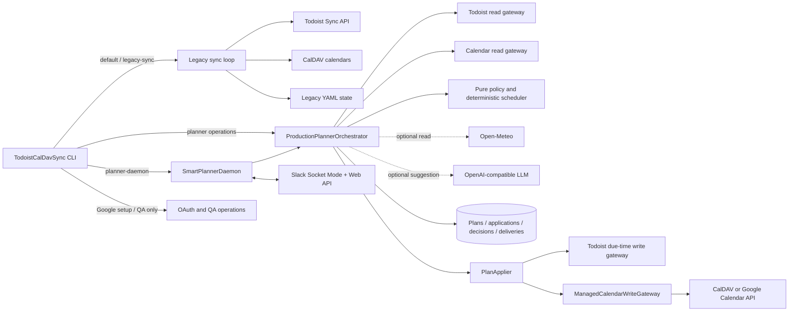
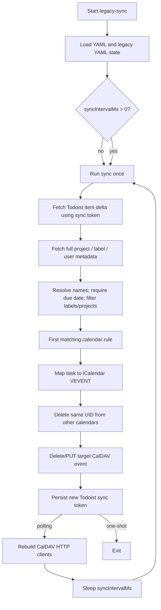
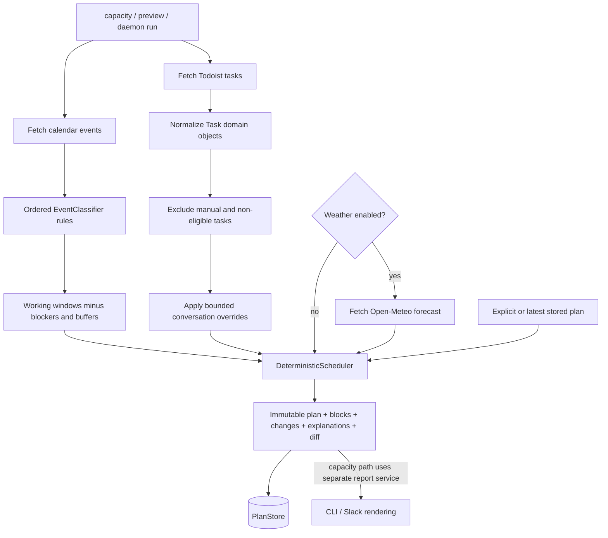
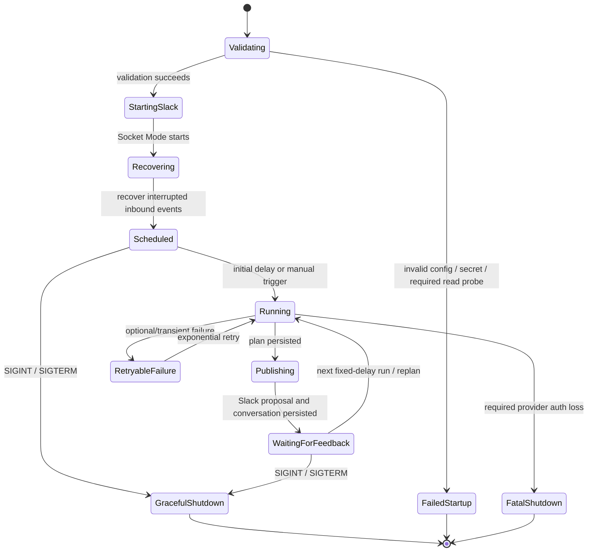
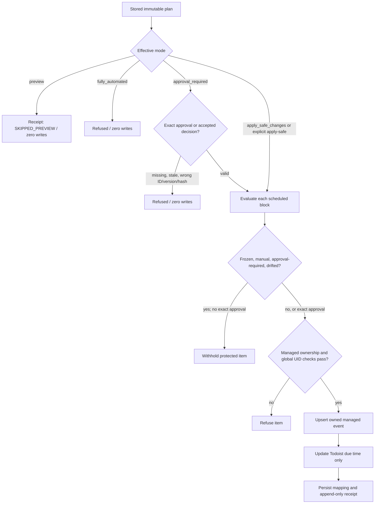
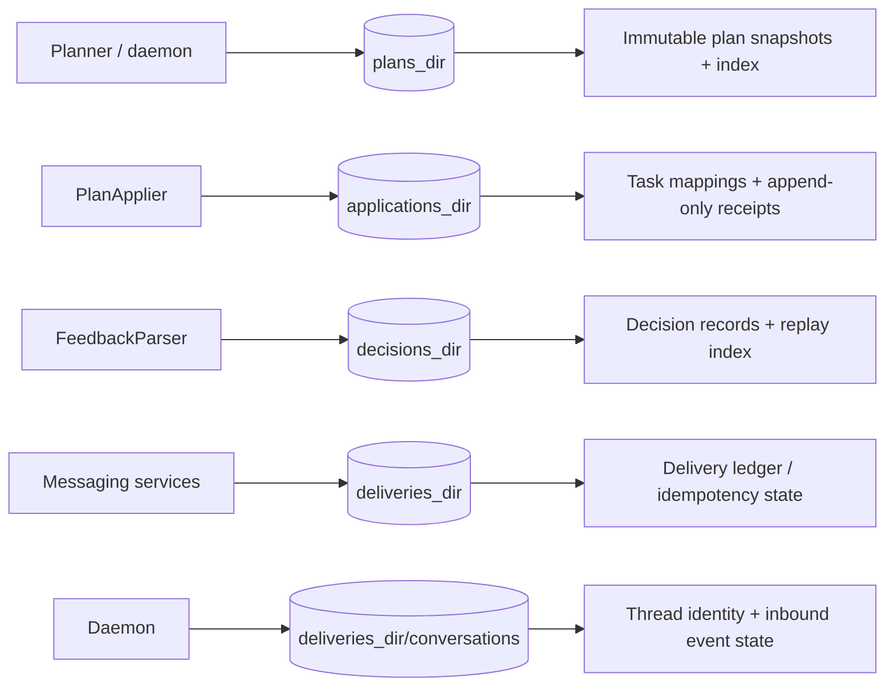
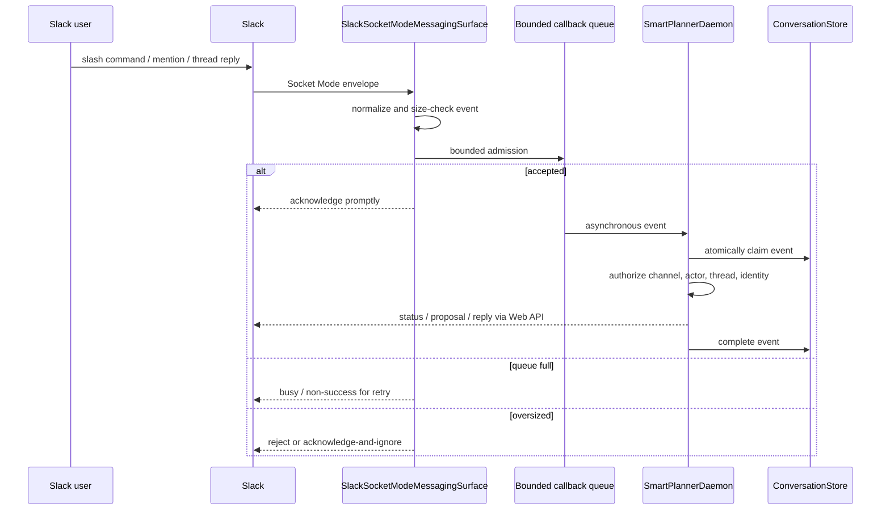
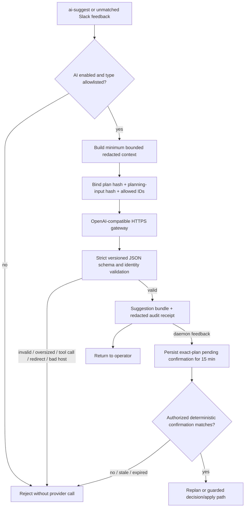
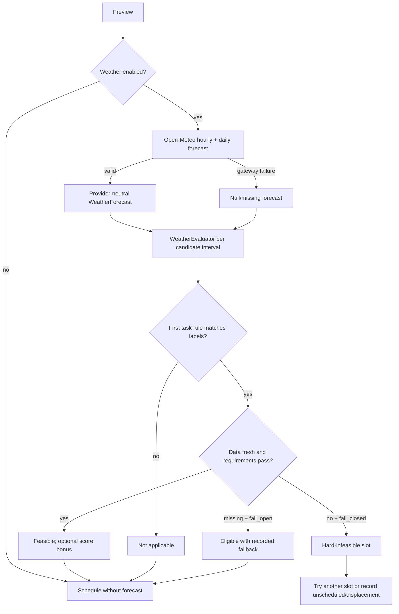

# Architecture

## 1. Purpose and scope

`todoist-caldav-sync` contains two related runtime architectures behind one executable:

1. **Legacy synchronization** mirrors selected Todoist tasks with due dates into CalDAV events. It is the default operation for backward compatibility.
2. **SmartPlanner** reads Todoist tasks and calendar availability, optionally evaluates weather, creates deterministic immutable plans, publishes proposals through Slack, and applies only changes permitted by explicit safety and approval gates.

The executable is implemented in Groovy and distributed by Gradle as `todoist-caldav-sync`. Java 25, Groovy 5, Picocli, Spock, WireMock, CalDAV4j/ical4j, Google Calendar API libraries, and Slack Bolt Socket Mode are the principal runtime and test technologies.

SmartPlanner is deliberately divided into three authority levels:

- **Read and calculate:** fetch provider data, normalize it, classify availability, and generate a plan.
- **Suggest and decide:** render/deliver proposals, parse deterministic feedback, and optionally request bounded AI suggestions.
- **Mutate:** apply a stored plan through `PlanApplier`, managed-calendar ownership checks, Todoist due-time-only writes, and durable receipts.

Neither the deterministic scheduler, Slack text, nor an LLM has direct provider mutation authority.

## 2. Repository map

| Area | Responsibility |
|---|---|
| `app/src/main/groovy/todoistcaldavsync/TodoistCalDavSync.groovy` | Shared CLI entry point, operation dispatch, and legacy synchronizer |
| `app/src/main/groovy/todoistcaldavsync/planner/` | SmartPlanner composition, daemon, domain, policy, scheduling, apply, state, messaging, AI, OAuth, and QA support |
| `app/src/main/resources/planner/ai/schemas/` | Versioned strict JSON schemas for bounded AI responses |
| `app/src/test/` | Spock unit/integration tests and recorded provider fixtures; HTTP contracts are tested with WireMock |
| `conf/` | Legacy and SmartPlanner example configuration, Slack manifest, and logging configuration |
| `docs/` | Operator guides for Slack, AI, Weather, OAuth, and manual QA |
| `.qa.example/` | Safe template for isolated Google/Todoist QA configuration |
| `.qa/` | Ignored operator-private QA credentials, state, and evidence; never a source-controlled runtime dependency |

## 3. Top-level architecture

### Architectural boundaries

- `ProductionPlannerOrchestrator` is SmartPlanner's production composition root. It constructs endpoints, gateways, stores, and services, but the planning algorithm remains separate from write authority.
- `DeterministicScheduler` accepts only normalized domain objects, configuration, a prior plan, and an optional provider-neutral weather forecast. It contains no HTTP, secret, Slack, LLM, or write dependencies.
- `ManagedCalendarWriteGateway` and the selected calendar adapter both enforce the configured managed-output boundary.
- `PlanApplier` is the only service that coordinates calendar and Todoist mutations.
- `AiAssistanceService` has no plan/config store, decision store, messaging gateway, `PlanApplier`, or remote-write gateway.
- Slack input is normalized and queued before daemon processing; callback threads do not plan or mutate providers.

## 4. CLI and operational modes

`TodoistCalDavSync.run` parses the configuration and logging files, validates the requested operation, and dispatches to one of these groups.

### 4.1 Runtime operations

| Operation | Lifecycle | Main behavior |
|---|---|---|
| `legacy-sync` | One run or an infinite polling loop | Original Todoist-to-CalDAV event mirroring |
| `planner-daemon` | Long-running | Startup probes, multi-horizon planning schedules, Slack proposals, thread feedback, guarded apply |
| `capacity` | One-shot, read-only | Capacity report over explicit bounds |
| `preview` | One-shot, read-only externally | Builds and stores a deterministic plan |
| `apply` | One-shot, guarded writes | Applies a stored plan according to its stored/configured mode and optional exact approval file |
| `apply-safe` | One-shot, safe-only writes | Applies ordinary eligible changes and withholds protected changes |
| `deliver` | One-shot Slack delivery | Renders one kind or all currently due message intents and records delivery receipts |
| `feedback` | One-shot decision creation | Parses and persists structured feedback; never applies as a side effect |
| `apply-decision` | One-shot, guarded writes | Revalidates a stored decision and explicitly applies it |
| `ai-suggest` | One-shot suggestion | Requests a bounded, schema-validated suggestion for a stored plan |

### 4.2 Google OAuth and isolated QA operations

`google-oauth-bootstrap`, `google-oauth-bootstrap-qa`, `google-oauth-import-legacy-qa`, `google-qa-calendars-list`, and `google-qa-calendars-provision` are intentionally separate from normal planning. They validate their restricted configuration shape, use separate normal and QA token stores, require explicit confirmation flags where appropriate, and exit without starting the planner. Normal planner operations reject QA provisioning flags.

## 5. Original legacy synchronization

The legacy path remains the default when `--operation` is omitted.

### 5.1 Mapping rules

- Todoist item inclusion is controlled by configured labels and projects.
- Calendar routing uses ordered rules. Rule terms support label names, `NOT`, and `p:` project terms joined by `AND`; the first matching rule selects the calendar.
- The event UID is a stable Base32 encoding of Todoist user ID plus task ID.
- The event title can receive a calendar-specific prefix; description includes project, labels, and priority.
- Native Todoist duration takes precedence. Otherwise a short `tN` label supplies duration, falling back to 30 minutes.
- Date-only tasks are rendered at 09:00 local time.

### 5.2 Legacy loop, sleep, and state

- A positive `syncIntervalMs` creates an infinite loop. Each cycle catches all failures, logs them, sleeps exactly `syncIntervalMs`, and tries again.
- A non-positive interval executes one uncaught sync and exits.
- `rateLimitMs` adds sleeps between selected provider mutations and retries.
- The legacy YAML state holds Todoist's incremental `syncToken` and the API-v1 migration marker.
- A malformed state file logs an error and starts with empty state, forcing a safe full-sync path.
- HTTP clients are rebuilt after successful polling cycles. Delete and rate-limit paths use bounded retry/backoff plus connection-pool monitoring/reset logic.
- `dryRun` suppresses calendar and state writes, while still exercising the read, filter, route, and render flow.

## 6. SmartPlanner planning pipeline

### 6.1 Input normalization and policy

- Todoist maps are converted to provider-neutral `Task` objects. Native duration overrides duration labels, which override the configured default.
- Tasks carrying the configured manual label are excluded from SmartPlanner scheduling.
- An optional scheduling-label allowlist further narrows candidates.
- Calendar events become provider-neutral `CalendarEvent` objects and are classified by ordered rules as hard blockers, soft blockers, informational events, or managed output.
- `AvailabilityCalculator` intersects configured working windows with event roles and buffers. Hard blockers remove capacity; soft blockers remain visible with a penalty; informational events do not consume capacity.

### 6.2 Deterministic scheduling

The scheduler:

1. sorts tasks deterministically by deadline, priority, and ID;
2. preserves eligible frozen or manually moved prior placements according to stability policy;
3. builds same-project focus units when batching is enabled;
4. finds feasible placements within free slots, deadlines, duration, and bilateral block buffers;
5. applies deterministic scoring for priority, deadline risk, context, batching, churn, soft conflicts, fragmentation, and weather suitability;
6. splits an unplaceable focus unit back into individual tasks;
7. records scheduled blocks, unscheduled reasons, changes, explanations, and weather displacement links;
8. tags near-term moves as `approvalRequired` rather than granting itself write authority; and
9. computes stable plan identity and a human-readable diff.

The current scheduler is greedy and deterministic, not an optimization solver. Given the same normalized inputs, configuration, prior plan, and fixed clock, it produces the same result.

### 6.3 Calendar providers

SmartPlanner requires exactly one calendar provider:

- **CalDAV:** `CalDavHttpGateway` performs bounded calendar reads and writes against explicitly configured calendars.
- **Google Calendar API:** `GoogleCalendarApiGateway` uses renewable installed-app OAuth state and provider-returned calendar IDs.

Both implement `CalendarReadGateway` and `CalendarWriteGateway`. Calendar reads span configured calendars. Writes are limited to the one calendar whose logical name matches `planner.output_calendar` and whose role is `managed_output`. Deterministic planner UIDs and ownership metadata prevent adoption, overwrite, or deletion of unrelated events. Global UID lookup acts as a collision barrier.

## 7. Daemon behavior

`planner-daemon` is the primary long-running SmartPlanner lifecycle. It is distinct from the legacy polling loop.

### 7.1 Startup sequence

1. The CLI builds `ProductionPlannerOrchestrator`, which validates planner and integration configuration and constructs stores and provider adapters.
2. `planner.daemon.enabled` must be true.
3. If `startup_connectivity_check` is true, the orchestrator performs bounded read-only Todoist and calendar probes. A failure is deliberately uncaught and startup fails before readiness.
4. The Slack surface resolves its bot and app tokens, registers command/event handlers, starts an outbound Socket Mode connection, and creates the Web API outbound gateway.
5. Persisted inbound events left `PENDING` or owned by a prior interrupted process are offered for recovery.
6. Each configured `planning_run` is scheduled independently.

### 7.2 Planning runs, intervals, and sleep behavior

Each planning run has:

- a unique `name`;
- a planning `horizon`;
- a fixed-delay `interval`;
- an `initial_delay`; and
- `run_on_startup`, which replaces the initial delay with zero.

The daemon uses a `ScheduledExecutorService` with at least two non-daemon worker threads and `scheduleWithFixedDelay`. Therefore the next interval is measured **after the previous invocation completes**, rather than at a fixed wall-clock timestamp. Runs do not use a central sleep loop.

A run reads current provider data, creates and persists a plan, publishes a Slack proposal, persists exact thread correlation, then waits for feedback while the scheduler remains available for other work.

The main CLI thread calls `awaitTermination`, which sleeps for one second at a time only to keep the process alive and observe shutdown/fatal state. This one-second sleep does not determine planning cadence.

### 7.3 Overlap, coalescing, and serialization

- Every named run has a `running` flag and a one-bit `pending` flag.
- A trigger arriving while that run is active is coalesced into exactly one pending rerun rather than queued without bound.
- A process-wide `mutationLock` serializes plan/publish and replan sections across all runs and feedback events. This prevents concurrent state transitions from exposing inconsistent current-plan identities.
- When work finishes, a pending trigger is scheduled immediately.

### 7.4 Retry and failure classification

A non-fatal scheduled-run failure increments a per-run retry counter and schedules an additional retry with:

`min(max_delay, max(initial_delay, initial_delay × multiplier^(attempt-1)))`

The exponent is bounded, and the regular fixed-delay schedule remains alive. A successful scheduled run clears the retry counter.

- Required Todoist/CalDAV authentication or authorization loss is fatal and requests orderly daemon shutdown.
- Transient transport/rate-limit/server failures, Slack send/status failures, Weather failures, and LLM failures are contained at their work-item boundaries where possible.
- Optional Weather failure becomes missing forecast data so the configured `fail_open`/`fail_closed` policy decides placement.
- Slack working-status failure is logged but never changes authority or daemon liveness.
- Ambiguous provider mutation or delivery outcomes are recorded as unknown/reconciliation-required and are not blindly retried.

### 7.5 Shutdown

The CLI installs a JVM shutdown hook. `close()`:

1. stops accepting daemon work;
2. calls orderly scheduler shutdown;
3. waits up to `shutdown_timeout`;
4. interrupts remaining scheduler work if needed;
5. closes Socket Mode and its callback executor; and
6. closes the orchestrator.

If a fatal required-provider authentication failure stopped the daemon, `awaitTermination` throws so the CLI exits nonzero.

### 7.6 Scheduled delivery intents versus daemon planning runs

SmartPlanner contains two scheduling concepts that must not be confused:

- `planner.daemon.planning_runs` are live recurring daemon tasks and directly generate/publish proposals.
- `planner.messaging.schedules` describe when summary/risk **delivery intents** are due. `MessagingService.dueIntents` evaluates daily, weekly, and restricted cron-like local-time windows when the `deliver` operation or an embedding host calls it. The current `SmartPlannerDaemon` does not independently poll these message schedules; daemon proposal publication is driven by `planning_runs`.

This distinction is important when adding future scheduled summary delivery to the daemon.

## 8. User approval and authority flow

### 8.1 Operational modes

- **`preview`:** plan generation and plan persistence are allowed; provider writes are always refused. Calling `apply` produces a zero-write receipt.
- **`approval_required`:** `apply` requires an `Approval` bound to exact `planId`, `planVersion`, and semantic `planHash`.
- **`apply_safe_changes`:** ordinary safe blocks may apply without approval. Frozen blocks, manual overrides, approval-required changes, and drifted resources remain withheld unless the path carries a valid exact approval where supported.
- **`fully_automated`:** unavailable by design. Both ordinary apply and safe-apply paths refuse with zero writes.

A plan stores the mode under which it was created. Configuration-level preview and fully-automated safety checks cannot be bypassed by a more permissive caller.

### 8.2 Approval files

The one-shot `apply` operation may load JSON or YAML containing exact plan identity. A missing approval, version mismatch, or hash mismatch produces a refused receipt. Approval is not inferred from a filename, operator intent, or current latest plan.

### 8.3 Structured feedback and decisions

The one-shot sequence is deliberately two-step:

1. `feedback` parses an authorized, structured command and persists a `DecisionRecord`; it never calls `PlanApplier`.
2. `apply-decision` reloads the decision and plan, rejects conflicts/replays/stale identity, converts only an exact accepted `APPROVE` decision into an approval, and invokes the guarded apply path.

`REJECT`, `STATUS`, `HELP`, and `REQUEST_CHANGES` are no-op decisions. An accepted `APPLY_SAFE` decision invokes the explicit safe-only path. Decision replays do not apply twice.

### 8.4 Slack thread approval

In daemon mode:

1. a proposal parent message is correlated to one exact current plan/proposal identity;
2. only configured actors in the configured channel may act;
3. feedback is accepted only in that proposal's thread;
4. ordered regex rules map deterministic phrases to actions;
5. approval reloads and verifies the current stored plan and records an exact decision;
6. `applyDecision` revalidates the decision and applies; and
7. the conversation becomes terminal (`APPLIED`, `REJECTED`, `ACKNOWLEDGED`, or `SAFE_CHANGES_APPLIED`) as appropriate.

Replanning marks the prior identity as `PUBLISHING_REVISION` before exposing a revised proposal. The new revision remains in the same thread and replaces the conversation's exact current identity. Stale approvals therefore fail closed.

## 9. Mutation ordering, idempotency, and reconciliation

For each scheduled block, `PlanApplier` performs:

1. mode and approval gates;
2. protected/manual/frozen and approval-required checks;
3. drift detection against durable mappings and live state;
4. global UID and ownership collision checks;
5. live idempotency reads;
6. managed calendar upsert;
7. cleanup of a superseded owned UID, when necessary;
8. Todoist due-time update for each member task; and
9. per-task mapping plus append-only application receipt persistence.

The calendar is written before Todoist. If calendar succeeds and Todoist fails, the partial state is persisted and may be reconciled. Full idempotent skip requires both a live matching owned calendar event and a live matching Todoist due time; a local mapping alone is insufficient.

The Todoist write interface used by the applier updates **due time only**. It never mutates the Todoist deadline. Unknown outcomes create a reconciliation barrier, preventing another blind write until live state proves the result.

## 10. Durable state

SmartPlanner requires four distinct configured directories. They should be backed up and restored together.

- **PlanStore:** immutable, versioned JSON snapshots with deterministic IDs/hashes and an index.
- **ApplicationStateStore:** task-to-applied-event mappings and append-only application receipts.
- **DecisionStore:** authorized feedback decisions and correlation/message replay protection.
- **DeliveryLedger:** pre-send claims and terminal delivery receipts keyed by idempotency key.
- **ConversationStore:** Slack channel/thread to exact current plan/proposal correlation plus bounded inbound event deduplication/recovery.

State stores use process-level synchronization, filesystem locks, temporary files, flush, and atomic replace when supported. Malformed/truncated state fails explicitly rather than silently authorizing work.

Conversation events move through `PROCESSING`, `PENDING`, and `COMPLETED`. A completed event is ignored on replay. Work interrupted under a prior daemon owner is reclaimable after restart. Delivery state distinguishes `PENDING`, `DELIVERED`, `FAILED`, and ambiguous/unknown outcomes so provider success cannot be guessed from a failed local finalization.

## 11. Slack integration guide

### 11.1 Transport and threading

SmartPlanner uses an outbound Bolt Socket Mode WebSocket, so it requires no public inbound HTTP listener. The app token (`xapp-*`) is used to establish Socket Mode; the bot token (`xoxb-*`) is used for Web API calls. Configuration stores environment-variable names, not token values.

Supported inbound sources are:

- the configured slash command (normally `/smartplanner`);
- app mentions; and
- channel message events used for proposal-thread replies.

Supported command verbs are `plan`, `replan`, `status`, and `help`.

### 11.2 Callback admission and processing

A single worker with a bounded queue separates callbacks from planning. Accepted work is retried locally up to three times. Queue saturation does not pretend success: slash commands receive an explicit busy response and event callbacks can be redelivered.

### 11.3 Authorization and correlation

Events are ignored unless they:

- come from the configured channel;
- are not bot/self messages;
- come from an allowlisted actor; and
- for feedback, belong to an active known proposal thread.

Event ID (or channel/message timestamp fallback) is durably claimed before work. Conversations store channel, root thread timestamp, run name, exact plan ID/version/hash, proposal ID, iteration, prior identities, status, overrides, and pending AI confirmation.

### 11.4 Outbound delivery safety

Proposals and replies use `chat.postMessage`. `assistant.threads.setStatus` displays bounded working text while user-triggered work runs and is explicitly cleared. Status API failure is non-fatal.

Before provider send, the delivery ledger atomically claims the idempotency key. Concurrent/duplicate sends cannot both call Slack. A provider success followed by local ledger-finalization failure becomes unknown/reconciliation-required; SmartPlanner refuses blind resend.

### 11.5 Slack configuration and files

- App manifest: `conf/smartplanner-slack-app-manifest.example.yaml`
- Runtime guide: `docs/SLACK_INTEGRATION.md`
- Main surface: `planner/messaging/SlackSocketModeMessagingSurface.groovy`
- One-shot outbound adapter: `planner/adapters/SlackMessagingGateway.groovy`
- Daemon command/feedback logic: `planner/SmartPlannerDaemon.groovy`
- Rendering and scheduled intents: `planner/messaging/MessageRenderer.groovy` and `MessagingService.groovy`

## 12. AI integration guide

### 12.1 Authority model

AI is disabled by default and is an advisory side service. It does not participate in the deterministic scheduler unless a host explicitly invokes it for suggestions. Its output cannot directly change a plan, task, calendar event, policy, configuration, decision, or provider.

Allowed suggestion families are configuration-controlled:

- task suggestions;
- event-classification suggestions;
- temporary planning overrides; and
- conversational feedback interpretation.

### 12.2 Request and response flow

`LlmContextBuilder` bounds item counts and string lengths and redacts context. Requests bind the stored plan hash and a planning-input hash, cap request/response bytes and tokens, use temperature zero, require a selected strict JSON schema, and allow only configured HTTPS hosts. Redirects and model tool/function calls are rejected.

`LlmSchemaValidator` revalidates identity, allowed task/event IDs, actions, ranges, and schema structure. Audit receipts contain hashes, sizes, counts, provider/model identifiers, timing, outcome, and error class—not raw prompts, raw responses, or secrets.

### 12.3 Daemon confirmation flow

For unmatched proposal-thread text, AI may suggest an action. SmartPlanner posts a human-readable summary and persists it against the current plan ID/hash with a 15-minute expiry. It performs no action until the same allowlisted actor uses a configured deterministic phrase for that action. Stale, expired, mismatched, unknown-task, or out-of-range suggestions are cleared or rejected.

### 12.4 AI implementation files

- Operator guide: `docs/LLM_INTEGRATION.md` and `docs/AI_ASSISTANCE.md`
- Service boundary: `planner/ai/AiAssistanceService.groovy`
- HTTP adapter: `planner/ai/OpenAiCompatibleLlmGateway.groovy`
- Context/redaction: `planner/ai/LlmContextBuilder.groovy`
- Contracts/validation: `planner/ai/LlmContracts.groovy`, `LlmSchemaValidator.groovy`, and resource schemas
- Daemon interpretation/confirmation: `planner/SmartPlannerDaemon.groovy`

## 13. Weather integration guide

### 13.1 Role in planning

Weather is optional, read-only, and disabled by default. It affects only tasks that match an ordered weather task rule. With Weather disabled, no gateway is constructed or called during preview and scheduling behavior remains non-weather-aware.

### 13.2 Adapter behavior

`OpenMeteoWeatherGateway` requests hourly precipitation probability, precipitation, weather code, temperature, wind speed, and daylight plus daily sunrise/sunset. It validates coordinates, timezone, horizon, timeout, response size, HTTP status, JSON structure, aligned array lengths, finite numeric data, and strictly increasing intervals.

Provider-local civil timestamps are resolved in the configured IANA timezone. DST folds map repeated local hours to distinct valid instants; nonexistent spring-gap times fail schema validation rather than silently shifting.

The gateway exposes no credential or write surface.

### 13.3 Evaluation and fallback

The first case-insensitive label-matching task rule wins. Required limits can make a candidate interval hard-infeasible; preferred conditions can adjust score. Forecast freshness uses `max_age`.

- `fail_closed` blocks weather-sensitive placement when required forecast data is missing, stale, or incomplete.
- `fail_open` allows placement but records the fallback in explanations.

A prior frozen/manual outdoor placement that becomes weather-invalid is not silently retained. The scheduler attempts another interval and records the reason, or leaves the task visibly unscheduled. When deterministic indoor work occupies capacity released by a weather-invalid task, reciprocal replacement metadata explains that displacement.

### 13.4 Weather implementation files

- Operator guide: `docs/WEATHER_INTEGRATION.md`
- Provider port: `planner/adapters/WeatherGateway.groovy`
- Open-Meteo adapter: `planner/adapters/OpenMeteoWeatherGateway.groovy`
- Pure policy: `planner/scheduling/WeatherEvaluator.groovy`
- Scheduler integration: `planner/scheduling/DeterministicScheduler.groovy`
- Domain: `planner/domain/WeatherForecast.groovy`, `WeatherInterval.groovy`, and `WeatherEvaluation.groovy`

## 14. Configuration and secret handling

SmartPlanner configuration is parsed into `PlannerConfig` (planning policy) and `ProductionIntegrationConfig` (endpoints, selected providers, daemon/Slack settings, and state paths). Validation fails closed for invalid modes, intervals, regexes, endpoint shapes, duplicate resources, mixed calendar providers, overlapping state directories, inline secrets, and incomplete enabled integrations.

Relative state and referenced credential paths resolve from the configuration directory. Provider secrets are named by environment-variable references. Slack tokens, Todoist tokens, CalDAV passwords/tokens, OAuth client material, Google token stores, and AI keys must not be committed or copied into logs/evidence.

The safe example configuration keeps:

- `planner.mode: preview`;
- daemon disabled;
- messaging disabled;
- Weather disabled; and
- AI disabled.

Operators should enable integrations independently in isolated environments and retain the same authority boundaries.

## 15. Testing architecture

The default Gradle `:app:test` task runs Spock on JUnit Platform and produces JUnit XML and HTML reports.

Tests are organized by boundary:

- pure domain/policy/scheduler tests use fixed clocks and recorded fixtures;
- orchestration tests inject in-memory Todoist/calendar/messaging gateways;
- HTTP adapter tests use WireMock rather than live providers;
- daemon tests inject schedulers, surfaces, and clocks instead of waiting in real time;
- Slack tests inject normalized events, fake Web API transport, and connection probes;
- AI tests validate strict schemas, isolation, size bounds, and WireMock request/response contracts;
- Weather tests cover clear/rain fixtures, failure policy, malformed payloads, and DST fold/gap behavior;
- state tests cover atomicity, locking, idempotency, replay, malformed state, and restart recovery; and
- apply tests verify preview refusal, exact approval, safe-only withholding, ownership, drift, partial failure, reconciliation, idempotency, and deadline invariance.

Live provider QA is intentionally separate from hermetic test execution and follows `docs/SMARTPLANNER_QA_RUNBOOK.md` with disposable accounts, explicit phase approval, before/after snapshots, redaction, cleanup, and stop conditions.

## 16. Key invariants

1. The scheduler is deterministic and has no mutation ports.
2. Preview performs no remote writes.
3. `fully_automated` is unavailable and always refuses writes.
4. Approval binds exact plan ID, version, and semantic hash.
5. Slack actor/channel/thread authorization never substitutes for exact plan identity.
6. AI suggestions have no direct mutation authority and require deterministic user confirmation where used by the daemon.
7. Weather is optional, read-only, and applies only to matching task rules.
8. Calendar writes target only planner-owned events in the configured managed-output calendar.
9. Todoist apply changes due time only and never silently changes deadlines.
10. Ambiguous provider outcomes require reconciliation and are never blindly retried.
11. Delivery and inbound events are durably idempotent across retries and restarts.
12. Plans, applications, decisions, and deliveries are separate durable stores and must be backed up/restored as one coherent state set.
